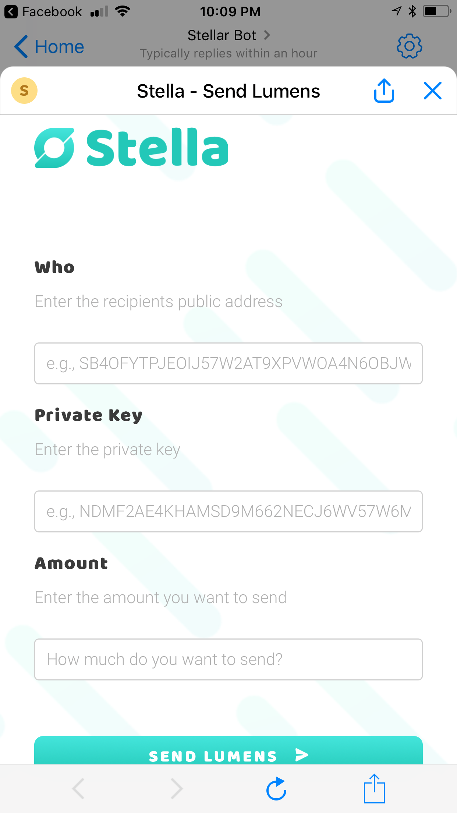

# Stella
Stella is a Facebook Messenger extension for sending Stellar Lumens. It allows users to send lumens, check account balances, and create new account key pairs through a Messenger webview.

# Screenshots

  
  
  

 
# Future of Stella:
* Link public account ids to Facebook profile pseudonyms
* Deploy app on Stellar main-net
* Send output message to receiver for payment confirmation
* Feature for displaying recent transaction history

# Award:
Best Open Source Contribution Project at Columbia University DevFest Hackathon
Check out our hack [HERE](https://devpost.com/software/stellarapp-hc0jby)

# Using Stella
The app is currently under review by Facebook and should be publicly available shortly. 
